# Procesverslag
Markdown is een simpele manier om HTML te schrijven.  
Markdown cheat cheet: [Hulp bij het schrijven van Markdown](https://github.com/adam-p/markdown-here/wiki/Markdown-Cheatsheet).

Nb. De standaardstructuur en de spartaanse opmaak van de README.md zijn helemaal prima. Het gaat om de inhoud van je procesverslag. Besteedt de tijd voor pracht en praal aan je website.

Nb. Door *open* toe te voegen aan een *details* element kun je deze standaard open zetten. Fijn om dat steeds voor de relevante stuk(ken) te doen.

## Jij

  
uitwerken voor kick-off werkgroep

  ### Auteur:
  Chinyere Onyebuchi (vervangen door jouw naam)

  #### Je startniveau:
  blauw (kies uit zwart, rood óf blauw)

  #### Je focus:
  Surface plane (kies uit responsive óf surface plane)
 

## Je website

  
uitwerken voor kick-off werkgroep

  ### Je opdracht:
  link naar de website die je gaat namaken óf de naam/omschrijving van je eigen ontwerp
  https://www.aceandtate.com/nl

  #### Screenshot(s) van de eerste pagina (small screen): 
  hier de naam van de pagina  Ace & Tate Oogmeting in de winkel
  

  #### Screenshot(s) van de tweede pagina (small screen):
  hier de naam van de pagina Ace & Tate Ons verhaal 
  
 

## Toegankelijkheidstest 1/2 (week 1)

  
uitwerken na test in 2e werkgroep

  ### Bevindingen
  Lijst met je bevindingen die in de test naar voren kwamen:
1. Er zijn een paar foutmeldingen op de pagina's. 
2. Het lijkt erop dat je niet met toetsen door de pagina's kun navigeren, alleen scrollen.
3. Er wordt niet overal gebruik gemaakt van headings.
4. Veel afbeeldingen bevatten alternatieve tekst die niet beschrijvend genoeg is. 
5. Video's kunnen niet gepauzeerd worden, er wordt gebruik gemaakt van autoplay.
6. Het lijkt erop dat het niet mogelijk is om links te skippen.
7. Er is geen dark of light mode.
8. Het lijkt erop dat je tekst niet kunt vergroten, je alleen inzoomen op de pagina.

 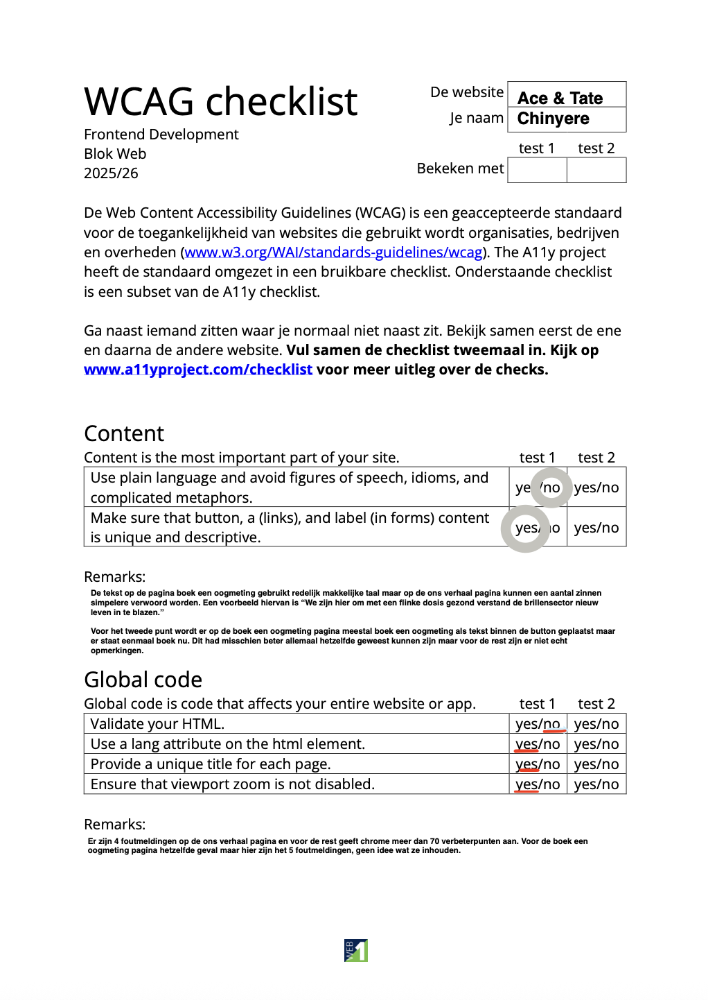
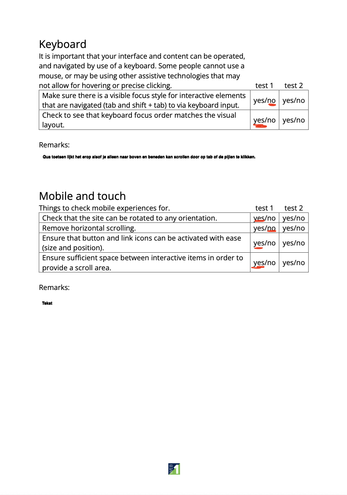
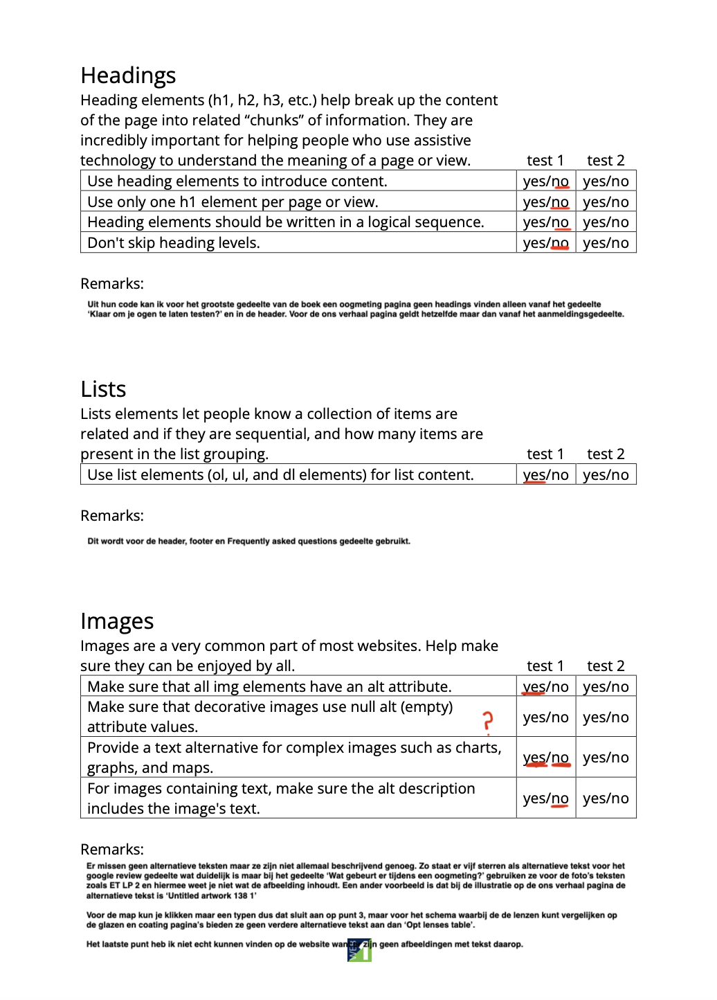
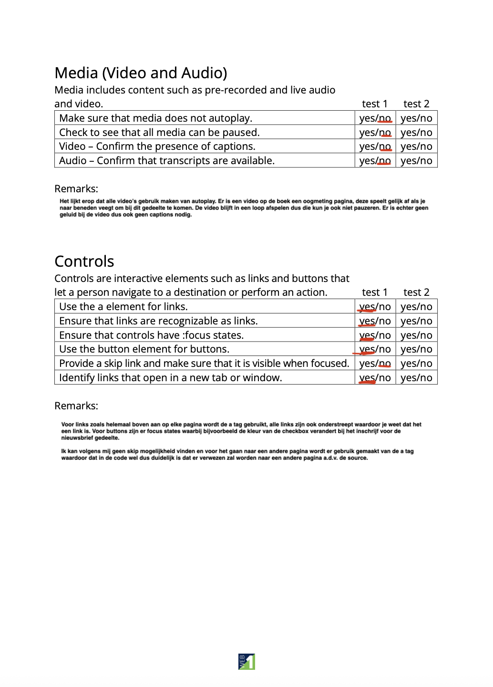
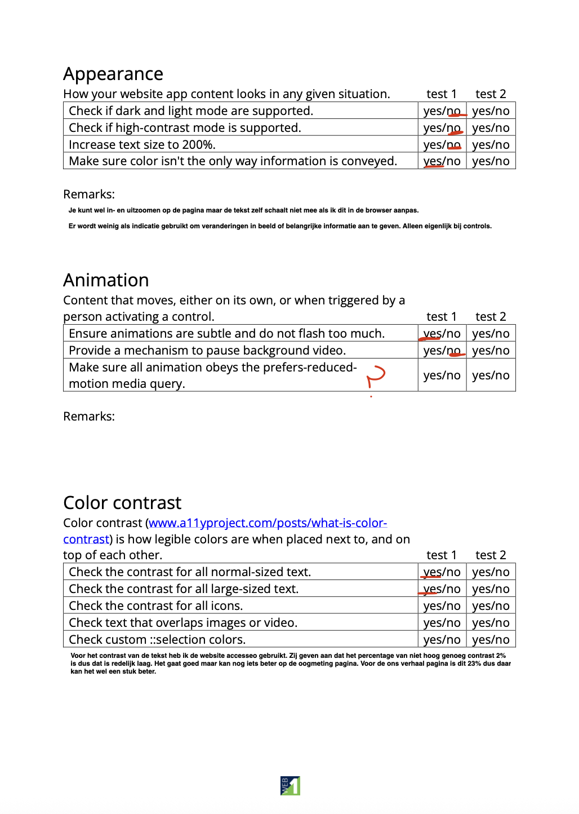

## Breakdownschets (week 1)

  
uitwerken na afloop 3e werkgroep

  ### de hele pagina: 
  

  ### dynamisch deel (bijv menu): 
  

## Voortgang 1 (week 2)

  
uitwerken voor 1e voortgang

  ### Stand van zaken
  hier dit ging goed & dit was lastig (neem ook screenshots op van delen van je website en code)

Goed
1. Wat over het algemeen goed ging was het schrijven van de HTML voor beide pagina's. Doordat ik een breakdownsketch had gemaakt kon ik gelijk aan de slag zonder al te veel na te denken. Hier heb ik een paar kleine dingen toegevoegd of aangepast maar voor de rest klopte de basis structuur naar mijn gevoel al. 

2. Wat verder nog goed ging was het toepassen van de 'details and summary' tags binnen mijn HTML voor de oogmeting pagina. Hier was ik eerst niet bekend mee maar door de tip van Ivo heb ik op MDN hier informatie over gevonden en was het ook heel makkelijk om toe te passen. Wat ik ook heel fijn vind is dat je gelijk kunt zien dat het werkt. 

Lastig
1. Wat ik lastig vond was het opslaan van afbeeldingen. Op mijn website waren er een aantal afbeelding die ik niet door op de rechtermuisknop te drukken kon opslaan. Door te inspecteren ben ik uiteindelijk wel achter de bron gekomen. Soms merk ik dat dit nog wel lastig kan zijn omdat het soms wat zoekwerk kan vereisen door de hoeveelheid code. Daarbij werkt het ook niet voor alle afbeeldingen. Voor een aantal iconen in de header en footer kan ik bijvoorbeeld geen image tag vinden waardoor ik deze niet kan opslaan. Op de afbeeldingen is het verschil te zien. Dit is dan ook iets wat ik wil bespreken. 

2. Verder twijfel ik over hoe ik de HTML voor de header ga moeten schrijven. Nou denk ik daarvoor dat ik weer gebruik zal moeten van maken 'details and summary' maar doordat het mij niet lukte om de iconen op te slaan heb ik dit niet goed kunnen testen. Ik heb het nu voor een klein stuk getest met een andere afbeelding wat op de afbeelding te zien is, alleen twijfel ik of dat klopt. 

  ### Agenda voor meeting
  samen met je groepje opstellen

  | student 1      | student 2          | student 3    | student 4        |
  | ---            | ---                | ---          | ---              |
  | dit bespreken  | en dit             | en ik dit    | en dan ik dat    |
  | en dat ook nog | dit als er tijd is | nog een punt | dit wil ik zeker |
  | ...            | ...                | ...          | ...              |

Mijn vragen: 
1. Is er een manier om iconen op te slaan als het via het inspecteren niet lukt? Of mag je dan een zelfde soort icoon online opzoeken? (Kan ook screenshot maken natuurlijk en backgroundremover) 
2. Klopt de code die ik nu heb voor het uitklapmenu in de header?  
3. De validator geeft aan dat de header geen heading bevat. Moet ook daar een "verborgen" header gemaakt worden? 
4. Moet ik links toevoegen aan img grid van instagram posts? 
5. Moeten de twee pagina's die je maakt wel naar elkaar toe kunnen navigeren? 
6. Wat plaatsen bij form action?
7. Voor wat een id aanmaken regel 106? De validator geeft aan dat het moet. 
8. Mag je iconen in html gebruiken of moet je a.d.v. een ol stijlen? Gaat om frequent asked questions gedeelte.
9. Voor grote spaties door p en link gebruik kun je stijlen met CSS, klopt dat?

  ### Verslag van meeting
  hier na afloop snel de uitkomsten van de meeting vastleggen

Antwoorden:
1. Je kunt het beste de website icon.js gebruiken om iconen als svg toe te voegen. Als je een icoon aanklikt kopieren je de code van het icoon en dan kun je deze in je code plaatsen. (done)
2. Ja, je kunt summary and details gebruiken voor het hamburger menu. (done)
3. Ja, het beste is om wel een heading toe te voegen zodat het voor een screenreader goed te lezen is. 
4. Meestal wel maar hoeft niet per se in dit geval. 
5. Vergeten te vragen 
6. Is voor deze opdracht n.v.t. aangezien dit gebruikt wordt om naar echt naar andere pagina's te kunnen gaan. 
7. Je moet een id aanmaken voor de checkbox waaraan het label gelinkt is zodat het voor de browser duidelijk is.
8. Beide niet, beter om svg te vinden en die te gebruiken door een image tag toe te voegen. (done)
9. Nee, beter om de a link tag binnen de p tag te plaatsen. (done)

+ Een link maken van de afbeelding van het logo aangezien dit ook klikbaar is. (done)

## Voortgang 2 (week 3)

  
uitwerken voor 2e voortgang

  ### Stand van zaken
  hier dit ging goed & dit was lastig (neem ook screenshots op van delen van je website en code)

  Goed
  1. Voor mijn gevoel heb ik niet teveel classes of id's gebruikt dus dat gaat voor mijn gevoel wel goed. Ik kijk eerst echt of een element op een andere manier geselecteerd kunnen worden.

  2. Wat verder denk ik ook goed gaat is het indelen van mijn css. Toen ik begon was het heel slordig en stonden sommige dingen dubbel maar dat heb ik nu allemaal georganiseerd waardoor ik een beter overzicht heb. 

  Lastig
  1. Het positioneren van de elementen in de header gaat ook lastig. Ik heb dit eerst met grid geprobeerd maar kwam er niet uit. Met flexbox ben ik een stuk verder gekomen maar de iconen heb ik nog niet allemaal op de juiste plaats kunnen krijgen. Daarnaast heb ik ook nog geen idee hoe ik het hamburger menu moet oplossen.

  2. Het selecteren van de juiste selector. Ik merk dat ik nog erg door de war raak met nth-child en nth-of-type. Nu probeer ik steeds beide om te kijken of het lukt.

  ### Agenda voor meeting
  samen met je groepje opstellen

  | student 1      | student 2          | student 3    | student 4        |
  | ---            | ---                | ---          | ---              |
  | dit bespreken  | en dit             | en ik dit    | en dan ik dat    |
  | en dat ook nog | dit als er tijd is | nog een punt | dit wil ik zeker |
  | ...            | ...                | ...          | ...              |

  ### Verslag van meeting
  hier na afloop snel de uitkomsten van de meeting vastleggen

Mijn vragen/problemen
1. Ik kom er met de header niet uit. Grid geprobeerd, niet gelukt met flexbox verder gekomen maar positioneren van iconen lukt niet goed en het uitklap menu.
2. De validator geeft aan 'Start tag “body” seen but an element of the same type was already open.' Er is echter geen tweede body tag, wat houdt dit in?
3. Er moet een lijn tussen img en onze winkels zijn maar dit lukt mij niet om toe te voegen. Nummering van child vind ik onduidelijk.
4. Hoe kun je een checkbox selecteren om te stijlen? input type=["checkbox"] werkt niet, ook andere dingen geprobeerd.
5. Hoe kan ik de witruimte weghalen voor de link 'privacybeleid'?
6. Hoe kan ik laatste img in footer selecteren? last-child of nth type werkt niet
7. Is het erg als ik soortgelijke kleuren kies en niet die met dezelfde hexcode? Kan de hexcodes niet vinden bij het inspecteren. 
8. Moeten alle kleuren in de root of alleen de meest gebruikte? Fonts?
9. Zijn alt teksten nodig voor svg's? 

Antwoorden:
1. Even kijken naar de code voor het hamburger menu als voorbeeld staat. Summary details gaat niet mogelijk zijn. 
2. Dit komt doordat bijv. img een / voor het haakje heeft staan, dit mag verwijderd worden en dan zal de melding ook niet meer voorkomen. (Done)
3.Inmiddels gelukt door de img te selecteren binnen de class. (Done)
4. Je kunt niet alles stijlen van een checkbox. Transform scale (2) kan als oplossing. !lukt niet
5. We zijn erachter komen dat er wel witruimte is voor de .leftAligned a (gebruikt voor de footer) a.d.v. de developertools. Als dit weggehaald wordt, dan klopt het. Oplossig footer .leftaligned a. (Done)
6. Inmiddels gelukt met last-child. (Done)
7. Nee, dat is geen probleem. (Done)
8. Alle kleuren in de root, fonts kunnen zelf ook. (Done)
9. Om het toegankelijker te maken kan een span aria label toegevoegd te worden. De alternatieve tekst moet in dit geval bijv. de functie van een icoon beschrijven zoals wishlisht voor een hartje of als het een afbeelding is net als met img een beschrijvende tekst zijn.

Overige punten/to do's die besproken zijn:
1. Header in body. (Done)
2. In footer geen sections maar a.d.v. ul stijlen en positioneren. (Done)
3. List-style-type gebruiken voor de vinkjes door eigen iconen toe te voegen. 
4. Classes toevoegen voor de verschillende lettertypes. (Done)
5. Formulier toevoegen in read.me van toegankelijkheidstest. 

Surface plane toevoegingen:
1. Bovenin header banner teksten laten veranderen.
2. Video niet op autoloop maar met button etc.
3. Dark mode uitgebreider uitvoeren.
4. ::after toepasssen voor Frequented asked questions uitklapgedeelte. 
5. ? 

## Toegankelijkheidstest 2/2 (week 4)

  
uitwerken na test in 9e werkgroep

  ### Bevindingen
  Lijst met je bevindingen die in de test naar voren kwamen (geef ook aan wat er verbeterd is):
  * Ik heb dit ingevuld nadat ik de website af heb gemaakt.  

  1. Alle afbeeldingen en de video hebben alternatieve tekst, wat de website van Ace and tate niet heeft. Hierdoor kan de screenreader doorgeven wat er op de afbeelding getoont wordt.
  2. Alle links met svgs hebben een aria-label, wat de website van Ace and tate niet heeft. Hierdoor kan de screenreader doorgeven wat voor link het nou echt is.
  3. Er worden geen foutmeldingen aangegeven in het console. 
  4. Er wordt voor elke sectie gebruik gemaakt van een heading. Hierdoor kan de screenreader het beter lezen.
  5. Voor de video speelt deze niet gelijk af maar heb je controls waarmee je dit kunt bedienen. Hierdoor heeft de gebruiker meer controle.
  6. Er is een darkmode. Hierdoor past de weergave van de website zicht aan op de voorkeuren van de gebruiker.
  7. Er is een laadpagina waardoor de screenreader dat kan aangeven als het aan het laden is. (Ik heb een aria-label hiervoor proberen toe te voegen maar kreeg met de W3 validatie een foutmelding dat dit niet kan bij een div.)

## Voortgang 3 (week 4)

  
uitwerken voor 3e voortgang

  ### Stand van zaken
  hier dit ging goed & dit was lastig (neem ook screenshots op van delen van je website en code)

Goed
1. Het toevoegen van classes voor stijling die meerdere keren maar onregelmatig voorkomt. Ik heb hierdoor gemerkt dat de details van mijn website meer lijken op die van ace & tate en dat het makkelijker is om overzicht te behouden aangezien ik niet hoef na te denken over wat elke nth-child/type is. 

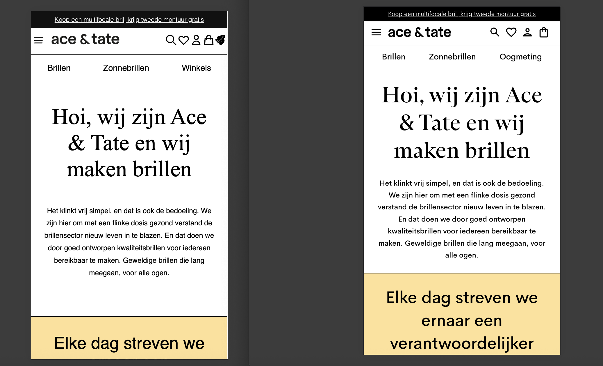

2. Voor de footer heb ik de sections weggehaald en merkte ik dat ik die eigenlijk inderdaad niet nodig had en overbodige secties had geschreven in eerste instantie. 

Lastig
1. Het laten werken van het hamburgermenu. Ik heb de code uit het voorbeeld gebruikt maar ik krijg in de browser de melding dat area-label = "hidden" niet gebruikt mag worden omdat het niet door screenreaders opgepakt zal worden. Ik heb dat weggehaald en door middel van id's variabele proberen te maken de buttons maar dat werkt niet. Dit is op dit moment mijn grootste struggle waardoor ik eigenlijk nog niet echt heb gekeken naar de toevoegingen voor suface plane.

  ### Agenda voor meeting
  samen met je groepje opstellen

  | student 1      | student 2          | student 3    | student 4        |
  | ---            | ---                | ---          | ---              |
  | dit bespreken  | en dit             | en ik dit    | en dan ik dat    |
  | en dat ook nog | dit als er tijd is | nog een punt | dit wil ik zeker |
  | ...            | ...                | ...          | ...              |

  ### Verslag van meeting
  hier na afloop snel de uitkomsten van de meeting vastleggen

  - punt 1
  - punt 2
  - nog een punt
  - ...

  Mijn vragen/problem:
  1. Punt 1 bij wat ik lastig vind.
  2. Hoe kun je darkmode nakijken? Als ik dat nu doe dan passen sommige kleuren zich aan maar andere niet.
  3. Ik heb geprobeerd om de checkbox te stijlen maar dat lukt nog steeds niet. Weten jullie hier een andere oplossing voor?

  Antwoorden:
  1. Je hebt niet twee buttons nodig met css en javascript kan de afbeelding aangepast worden. Javascript was blijkbaar ook niet goed gelinkd, code klopt wel maar het advies is om header gedeeltes in div's te zetten i.p.v. id's voor de ul's te maken. Als dat gedaan is kijken of het werkt.
  2. Bij instellingen aanpassen wordt goed gedaan. Kijk of het gebruiken van alleen hex of rgb verschil maakt. 
  3. Vergeten te vragen.

## Eindgesprek (week 5)

  
uitwerken voor eindgesprek

  ### Je uitkomst - karakteristiek screenshots:
  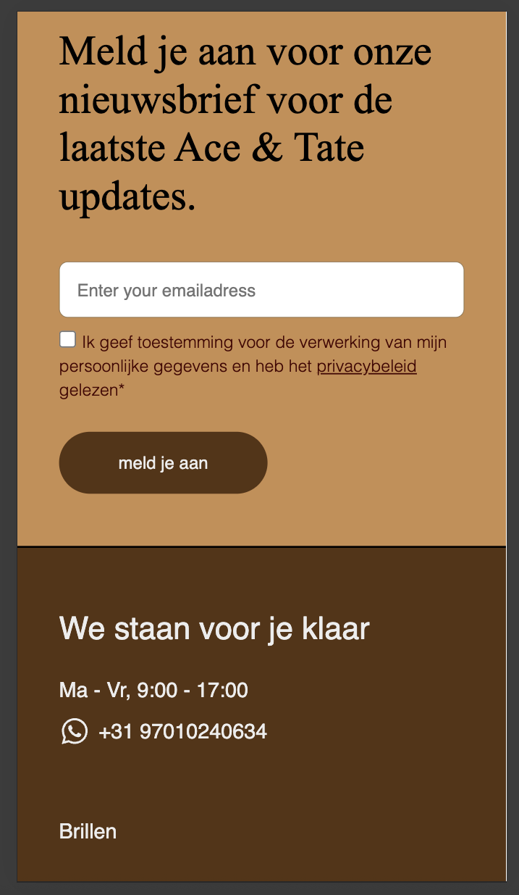
   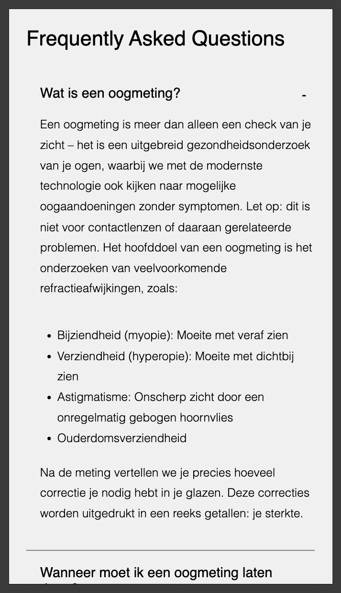
    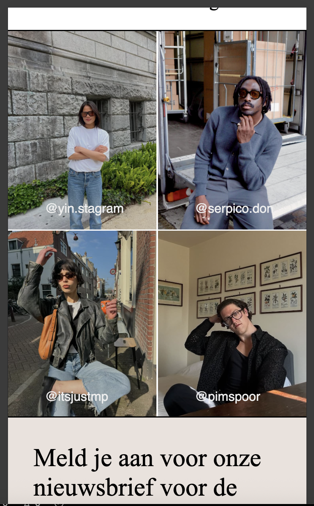

  ### Dit ging goed/Heb ik geleerd: 
  Korte omschrijving met plaatjes

1. Ik heb geleerd doe je een carousel kunt maken door middel van css. Dit verliep redelijk goed aangezien ik dit eerst kon oefenen met een opdracht en daarna kon toevoegen in mijn eigen code. 
  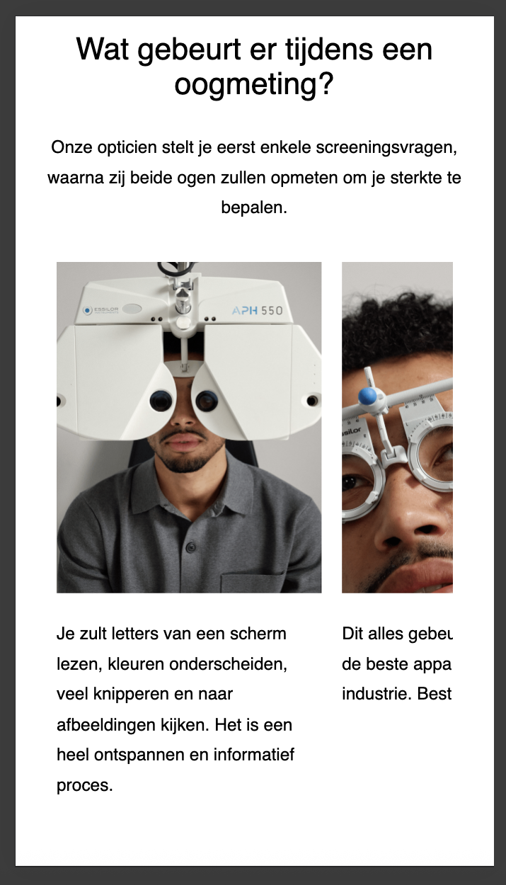

2. Wat ik heb geleerd is dat ik het gebruik van een class niet altijd hoef te vermijden. Voor de typografie en achtergronden probeerde ik in eerste instantie geen classes te gebruiken maar hierdoor kon ik niet uitgebreid stijlen en sommige delen überhaupt niet goed selecteren. Na het tweede voorganggesprek ben ik weer opnieuw door al mijn code gelopen en het ik wat meer classes toegevoegd. Hierdoor merkte ik dat mijn website steeds meer op die van Ace and tate begon te lijken en de code duidelijker is. Kort samengevat, heb ik een beter inzicht gekregen in wanneer je classes en nth-child/type kunt gebruiken. 

3. Als laatste heb ik meer over toegankelijkheid geleeerd en hoe je dit kunt toepassen. Zo had ik eerder nooit met een screenreader gewerkt maar door dit te doen kwam ik erachter dat iconen in de header geen betekenis hadden voor screenreaders. Hieruit ontstond mijn vraag of hier ook niet alternatieve tekst voor gebruikt kan worden, uiteindelijk was eruit gekomen dat het toevoegen van een aria-label een mogelijkheid is. Daarbij heb ik ook geleerd hoe je een dark mode maakt en op basis daarvan een thema kunt toevoegen. 
 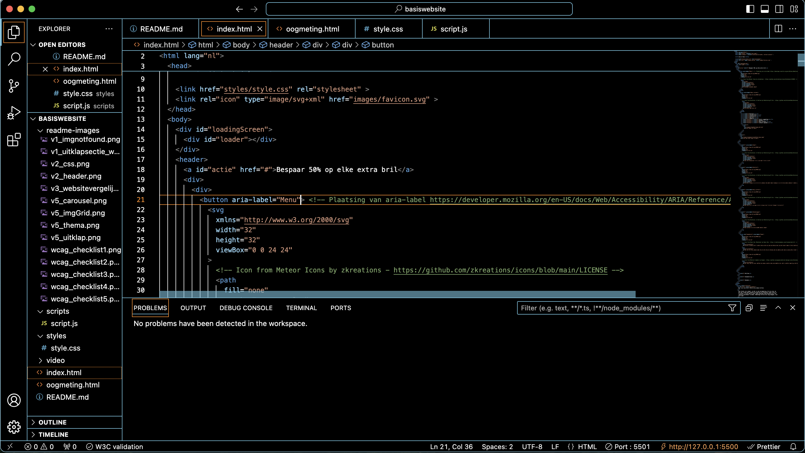

  ### Dit was lastig/Is niet gelukt:
  Korte omschrijving met plaatjes

  1. Bij het maken van het hamburgermenu liep ik heel erg vast. In eerste instantie probeerde ik het door de code uit de opdracht te gebruiken maar kreeg zelf in mijn console te zien dat het gedeelte aria-label hidden niet gebruikt mag worden. Ik ben toen gaan kijken naar hoe ik dit kan oplossen met ChatGPT en andere voorbeelden van een hamburgermenu nagegaan, alleen kwam ik er niet uit. Uiteindelijk heb ik hulp gekregen van Minke en ben ik eerst de code voor het hamburgermenu alleen gaan toevoegen dus zonder de andere elementen uit de header en werkte het menu eindelijk. Daarbij lijkt het wel een iets donkerdere kleur te zijn als het uitklapt, dan ik heb aangegeven. Ik kon niet achterhalen waardoor dit komt.
   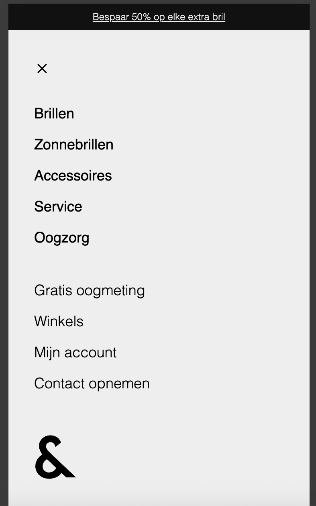

  2. Waar ik verder moeite mee had was het opmaken van de grid van afbeeldingen. Nou had ik snel en makkelijk instructie video's gevonden voor de werking van figcaption en al een idee hoe grid werkt. Alleen het samenbrengen van die twee was lastig omdat ik daar niet echt voorbeelden van kon vinden. 

  3. Wat niet volledig is gelukt, is het nieuwsbriefgedeelte. Een van de invulvelden zou een dropdown moeten zijn met een icoon maar het lukt mij niet om het icoon in het inputveld te krijgen en het dropdown gedeelte te coderen. Nou moet ik zeggen dat dit iets was waar ik nog best last-minute mee aan de slag ging dus ik heb er ook niet heel veel naar gekeken. Als ik meer tijd had, dan had ik dit nog af kunnen maken. 
  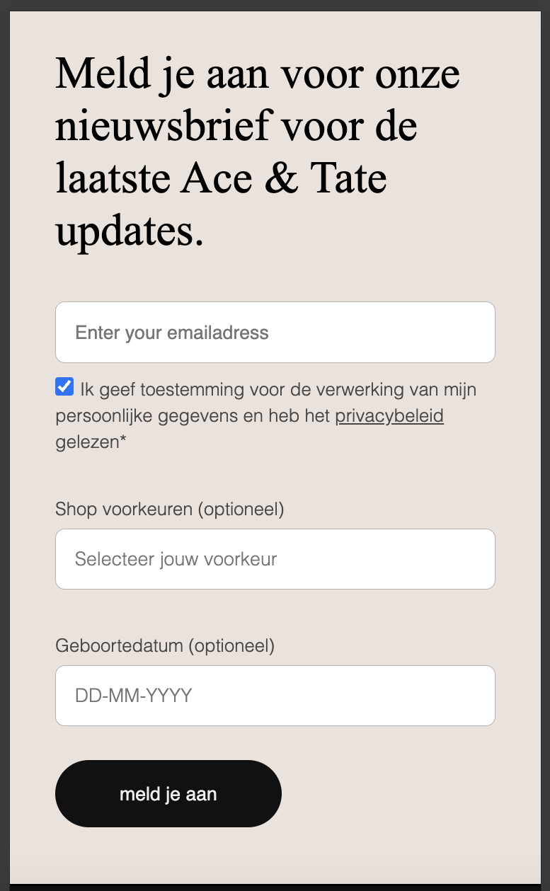

  4. Ik ben er heel laat achtergekomen dat het dikgedrukte gedeelte in de footer niet alleen voor stijling is maar een dropdown menu zou zijn om de locatie en taal aan te passen. Dit is mij dan ook niet binnen de tijd gelukt om te coderen. Als ik dit wel had gedaan, dan zou ik het anders stijlen en eventueel positioneren om duidelijker te maken dat dit instellingen zijn.  
  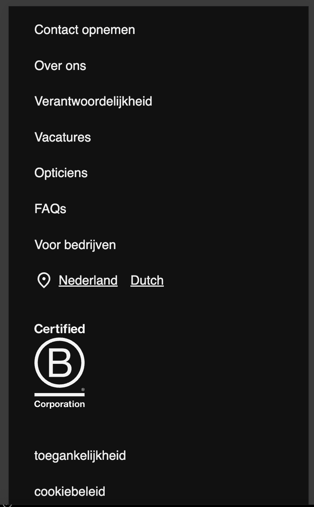

5. Wat wel gelukt is maar wellicht beter kon is het custom thema dat ik heb gemaakt. Nu vinden er alleen aanpassing plaats op het kleurenpalet maar ik denk dat het ook leuk zou zijn om iconen van blaadjes of bomen toe te voegen etc. Daarbij is dit hetzelfde geval voor de darkmode alleen daarbij gaat het meer om de afbeeldingen die niet overal meer zichtbaar zijn zoals op de afbeelding te zien is. Dat laatste is denk ik wel een belangrijk punt dat ik zou aanpassen als er meer tijd was geweest.
 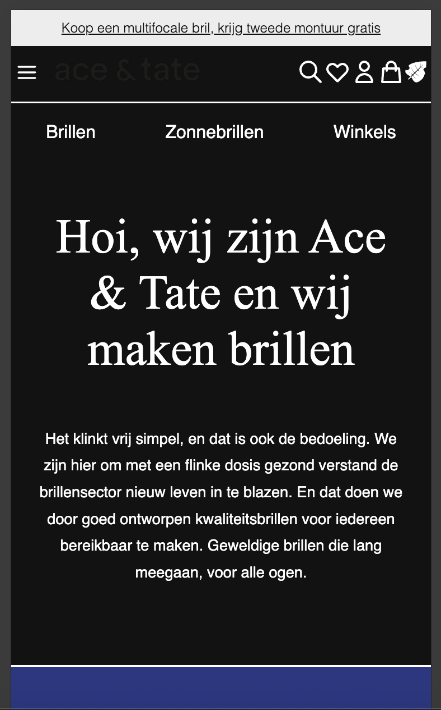

## Bronnenlijst

  
continu bijhouden terwijl je werkt

  Nb. Wees specifiek ('css-tricks' als bron is bijv. niet specifiek genoeg). 
  Nb. ChatGpT en andere AI horen er ook bij.
  Nb. Vermeld de bronnen ook in je code.

  1. HTML uitleg formulier opstellen https://www.w3schools.com/tags/tag_label.asp 
  2. HTML uitleg figure caption https://developer.mozilla.org/en-US/docs/Web/HTML/Reference/Elements/figcaption
  3. HTML uitleg details and summary https://developer.mozilla.org/en-US/docs/Web/HTML/Reference/Elements/details
  4. HTML Twee classes voor 1 tag kan https://www.w3schools.com/html/html_classes.asp
  5. CSS code voor weghalen van blauwe kleur van links https://stackoverflow.com/questions/6722467/how-do-i-remove-the-default-link-color-of-the-html-hyperlink-a-tag
  6. CSS instructie tekst positioneren op afbeelding https://www.youtube.com/watch?v=z-naBVXTi6g 
  7. CSS scrollbar onzichtbaar maken https://stackoverflow.com/questions/16670931/hide-scroll-bar-but-while-still-being-able-to-scroll
  8. JS uitleg setInterval https://www.w3schools.com/jsref/met_win_setinterval.asp
  9. JS uitleg audio toevoegen bij click op button https://dev.to/shantanu_jana/how-to-play-sound-on-button-click-in-javascript-3m48
  10. CSS uitleg ::after https://www.youtube.com/watch?v=dIUOWdwwZBw
  11. CSS load animatie maken https://www.w3schools.com/howto/howto_css_loader.asp
  12. CSS en JS loading page instructie https://www.youtube.com/watch?v=Yf5d_Zx3AaI
  13. CSS dark light scheme uitleg https://www.youtube.com/watch?v=zFFuV_vXNhY
  14. HTML aria-label uitleg https://developer.mozilla.org/en-US/docs/Web/Accessibility/ARIA/Reference/Attributes/aria-label
  15. Ivo heeft uitgelegd hoe ik svg's kan opslaan (door te inspecteren), gewezen op het gebruik van placeholders en summary and details.
  16. Minke voor hulp met het hamburgermenu 
  17. ChatGPT (in code aangegeven waarvoor)

